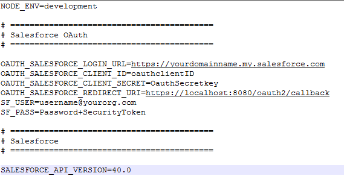
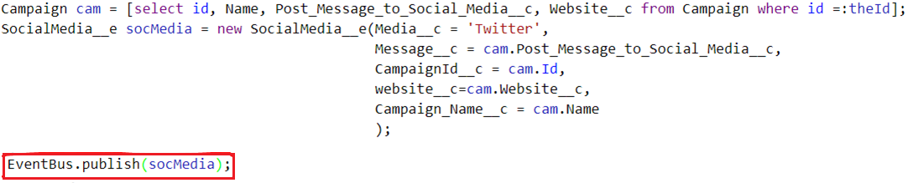

## Publish and Subscribe to Salesforce Platform event bus from both Salesforce and External Node.js app)

Here is a simple proof of concept that shows how to subscribe and publish to Platform Events. You need make few changes prior to setting up and testing out your publishing and subscription.

### Setup Steps for salesforce app and authentication

1. Log into your Salesforce org within the browser, create a connected oauth app.
2. Create an .env file in the same directory where **app.js** is with the structure and format as mentioned here.
    Provide all relevant details from saleforce connected app that you have created in step 1 
 
3. Create two platform events in salesforce from setup menu

  a. First, create a platform event SocialMedia__e as displayed below. 
    
   Then, publish to this event bus from salesforce campaign with the following code (either from developer console or create apex code that takes campaign Id)
   
   
   
  b. Second, create another platform event **campaignMemberEvent__e** from setup menu to receive user responses back  as shown below
  
  

4. Now that the setup is complete, you can play around with changes. You can write a trigger or use a process builder from salesforce to subscribe to "CampaignMemberEvent__e" to see the data in your salesforce org.

### Setup Steps for Twitter, to publish the message to twitter
1. Create an account with Twitter and go to apps.twitter.com
2. Create a project, this will generate Oauth tokens.
3. Update this information in your config file which is in the same directory.

### Running the App

To ensure we have the appropriate node packages installed, navigate to this project's directory and run `npm install`. 
Default url that this node.js app will be hosted on http://localhost:8080/, the url to get to sign up form will be http://localhost:8080/contact
You can change it to what ever port number you wish. Currently, it is set to 8080.

When this finishes, run `node app.js` to subscribe to the platform event. If there are any errors, these will be displayed in the console, otherwise terminal should display console.log information form node.js.

Create a platform event using process builder, Apex, or the API and observe the output in the terminal.
